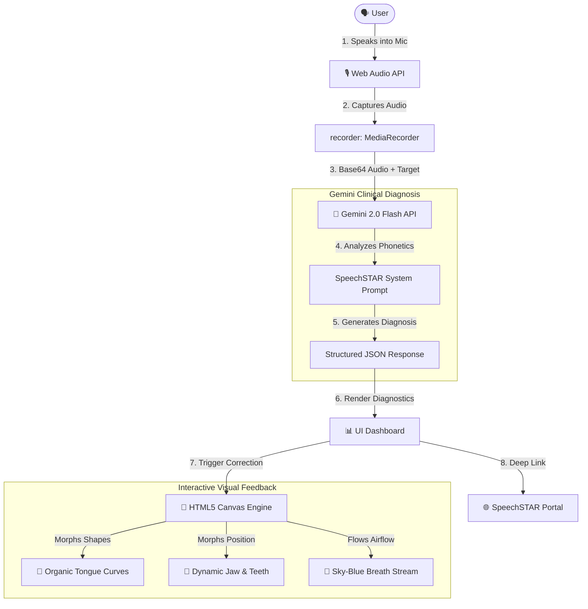

# Articulation AI (SpeechSTAR-Aligned Articulation Lab)

Articulation AI is an advanced, serverless web application designed to act as an interactive **AI Pronunciation & Accent Coach**. It bridges acoustic analysis and physical biomechanics, helping users correct pronunciation errors by showing them exactly *how* to move their mouth, jaw, and tongue.

Aligned with the **SpeechSTAR** clinical therapy framework, the application utilizes Google's **Gemini 2.0 Flash** model to act as a "Clinical Ear," diagnosing phonetic errors and rendering them as dynamic, morphing anatomical animations and direct deep-links to clinical speech resources.

---

## 🏗️ Design & Architecture

Articulation AI is designed as a **serverless, single-file application (`index.html`)**. It requires no backend server, database, or complex build pipelines—it runs entirely in the user's browser, communicating directly with the Gemini API.

### System Architecture Flow

### Core Architectural Pillars

1.  **Acoustic-Biomechanical Bridge (Gemini 2.0 Flash)**:
    *   The user's audio is captured via the browser's `MediaRecorder` API, compressed, and converted to Base64.
    *   It is sent directly to the Gemini API (`gemini-2.0-flash`) along with a highly structured system prompt.
    *   Gemini acts as the speech therapist: it transcribes the audio, compares it to the target sentence, identifies specific mispronounced words, and diagnoses the *manner* and *place* of articulation error.
    *   Gemini returns a clean, structured JSON payload detailing the errors, placement guides, and the exact anatomical articulators involved.

2.  **Dynamic Anatomical Rendering Engine (HTML5 Canvas)**:
    *   The **Articulatory Map** is rendered in real-time on an HTML5 2D Canvas.
    *   Unlike static images, the mouth, tongue, lips, teeth, and jaw are represented as vector paths.
    *   The engine uses **Vector Interpolation (Lerp)** to smoothly morph the anatomy. When a correction is triggered, the map animates the transition from the **Incorrect Position** (how the user said it) to the **Correct Position** (how they should say it).
    *   The entire lower jaw, chin, and lower teeth dynamically scale and drop/raise in sync with the phonetic target's required mouth opening (`lipGap`).

3.  **Clinical Resource Deep-Linking (SpeechSTAR)**:
    *   By reverse-engineering the SpeechSTAR portal's JQuery router, the application maps diagnosed errors to specific database IDs.
    *   The app generates **direct deep-links** (e.g., `https://speechstar.ac.uk/speech-sound-animations/#location=34`). When clicked, these links open the SpeechSTAR portal and **automatically pop open the exact side-by-side comparison video** in a modal on load.

---

## 📖 User Guide

### Prerequisites
*   A modern desktop web browser (Chrome, Safari, Firefox, Edge).
*   A working microphone.
*   A **Gemini API Key** (Get one for free at [Google AI Studio](https://aistudio.google.com/)). *Note: An API key is not required to run the Demo Mode.*

---

### Quick Start: Running the Demo (No API Key Required)

1.  Open [index.html](file:///usr/local/google/home/chengweih/wrk/repo/pronunciation_coach/index.html) in your web browser.
2.  You will land on the **Interactive Speech Clinic** dashboard (blank state).
3.  Click the blue **"Run Demo Diagnostic"** button on the left panel.
4.  This instantly loads a mock clinical run representing a common error: saying **"shells"** instead of **"sells"** (an Alveolar-to-Palatal shift).
5.  **Explore the Feedback**:
    *   **Accuracy Score**: Shows a 72% accuracy.
    *   **Interactive Articulatory Map**: Click on **"sells"** in the *Phonetic Pitfall Breakdown* at the bottom right. Watch the map on the right: the tongue will smoothly morph from the Palate (incorrect "sh" position, colored red) to the Alveolar Ridge (correct "s" position, glowing green), while the jaw adjusts its gap.
    *   **SpeechSTAR Video**: Click the blue **"View STAR Animation"** button in the breakdown. It will open a new tab directly to the SpeechSTAR portal and automatically pop open the side-by-side video comparing the "s" and "sh" sounds.

---

### Real-Time Practice Flow (With API Key)

To practice your own custom sentences in real-time:

1.  **Configure your API Key**:
    *   Click the **Gear Icon** (Settings) in the top right header.
    *   Paste your **Gemini API Key** into the input field and select your reference accent (US or UK).
    *   Click **Save configurations**. The status badge should show **"Gemini Live Ready"**.
2.  **Set your Practice Target**:
    *   Select a preset tongue-twister (e.g., sibilants, dental /th/ practice) or select **"Write Custom Sentence"** to type your own target.
3.  **Record your Speech**:
    *   Click **Start Recording** and read the target sentence aloud.
    *   Click **Stop Recording** when finished.
4.  **Analyze & Correct**:
    *   The app will show "Analyzing..." while Gemini processes your audio.
    *   Once loaded, review your accuracy score.
    *   Click on any diagnosed red-flag word in the breakdown to watch the mouth map animate the physical correction.
    *   Click **"View STAR Animation"** to watch the actual MRI-based video of a human mouth producing that sound.

---

## 🛠️ Technical Stack

*   **Markup & Layout**: HTML5, [Tailwind CSS](https://tailwindcss.com/) (utility-first styling), [Lucide Icons](https://lucide.dev/) (modern iconography).
*   **Logic & Animation**: Vanilla JavaScript (ES6+), HTML5 Canvas 2D Context, Web Audio API (`MediaRecorder`).
*   **AI Core**: Google [Gemini 2.0 Flash API](https://ai.google.dev/gemini-api/docs/models/gemini).
*   **Clinical Alignment**: [SpeechSTAR](https://speechstar.ac.uk/) (University of Glasgow, Queen Margaret University, University of Strathclyde).

---

## 📄 License & Credits

*   **Development**: Developed in collaboration with Google DeepMind.
*   **Phonetic Models**: Biomechanical guidelines and video resources are aligned with the SpeechSTAR project (Licensed under CC BY-NC-ND 4.0).
*   **AI Integration**: Powered by Google Gemini.
