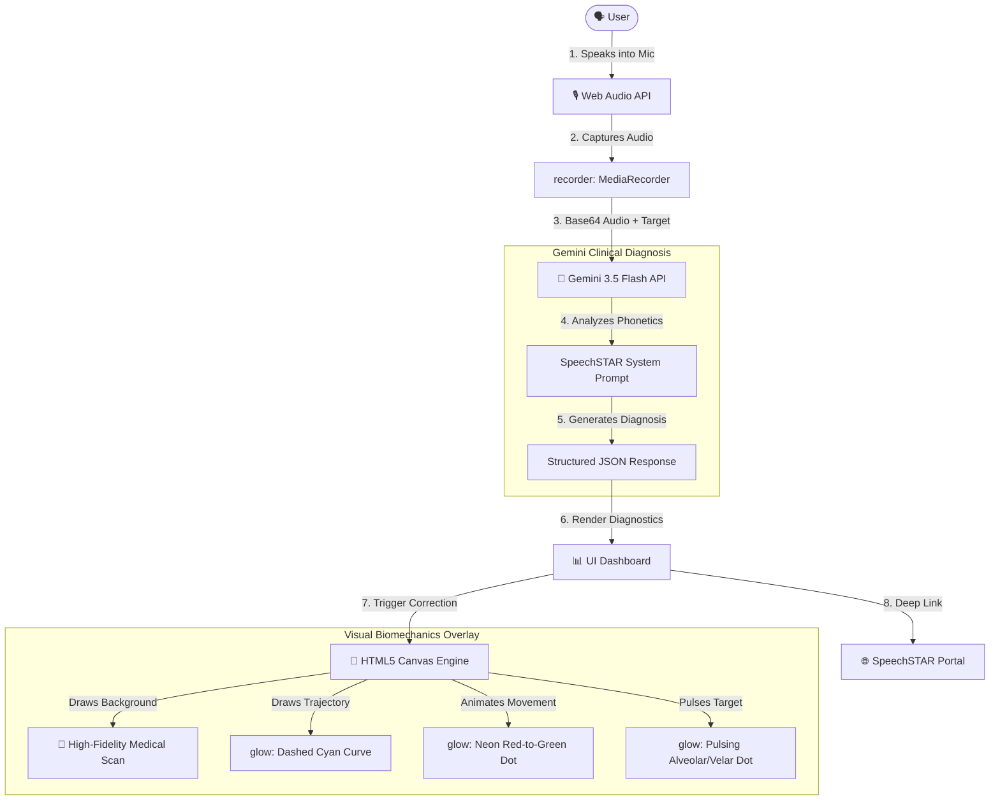

# Articulation AI - Speech Lab

Articulation AI is an advanced, serverless web application designed to act as an interactive **AI Pronunciation & Accent Coach**. It bridges acoustic analysis and physical biomechanics, helping users correct pronunciation errors by showing them exactly *how* to move their mouth, jaw, and tongue.

Aligned with the **SpeechSTAR** clinical therapy framework, the application utilizes Google's **Gemini 3.5 Flash** model to act as a "Clinical Ear," diagnosing phonetic errors and rendering them as dynamic trajectory animations on a high-fidelity articulatory map, alongside direct deep-links to clinical speech resources.

---

## 🏗️ Design & Architecture

Articulation AI is designed as a **serverless, single-file application (`index.html`)**. It requires no backend server, database, or complex build pipelines—it runs entirely in the user's browser, communicating directly with the Gemini API.

### System Architecture Flow


```mermaid
graph TD
    User([🗣️ User]) -->|1. Speaks into Mic| WebAudio[🎙️ Web Audio API]
    WebAudio -->|2. Captures Audio| MediaRec[recorder: MediaRecorder]
    MediaRec -->|3. Base64 Audio + Target| Gemini[🧠 Gemini 3.5 Flash API]
    
    subgraph "Gemini Clinical Diagnosis"
        Gemini -->|4. Analyzes Phonetics| Prompt[SpeechSTAR System Prompt]
        Prompt -->|5. Generates Diagnosis| JSON[Structured JSON Response]
    end
    
    JSON -->|6. Render Diagnostics| Dashboard[📊 UI Dashboard]
    Dashboard -->|7. Trigger Correction| Canvas[🎨 HTML5 Canvas Engine]
    Dashboard -->|8. Deep Link| SpeechSTAR[🌐 SpeechSTAR Portal]
    
    subgraph "Visual Biomechanics Overlay"
        Canvas -->|Draws Background| Map[🔬 High-Fidelity Medical Scan]
        Canvas -->|Draws Trajectory| Path[glow: Dashed Cyan Curve]
        Canvas -->|Animates Movement| Particle[glow: Neon Red-to-Green Dot]
        Canvas -->|Pulses Target| Target[glow: Pulsing Alveolar/Velar Dot]
    end
```

### Core Architectural Pillars

1.  **Acoustic-Biomechanical Bridge (Gemini 3.5 Flash)**:
    *   The user's audio is captured via the browser's `MediaRecorder` API, compressed, and converted to Base64.
    *   It is sent directly to the Gemini API (`gemini-3.5-flash`) along with a highly structured system prompt.
    *   Gemini acts as the speech therapist: it transcribes the audio, compares it to the target sentence, identifies specific mispronounced words, and diagnoses the *manner* and *place* of articulation error.
    *   Gemini returns a clean, structured JSON payload detailing the errors, placement guides, and the exact anatomical articulators involved.

2.  **Visual Biomechanics Overlay Engine (HTML5 Canvas)**:
    *   The **Articulatory Map** uses a high-fidelity sagittal head cross-section medical scan as a static background.
    *   The Canvas engine overlays real-time vector animations on top of this scan:
        *   **Trajectory Path**: A glowing dashed cyan line arches from the incorrect placement zone (e.g., Hard Palate) to the correct target zone (e.g., Alveolar Ridge).
        *   **Motion Particle**: A glowing neon particle slides along the trajectory path to illustrate the movement. The particle dynamically shifts color from **red** (incorrect) to **green** (correct) as it moves.
        *   **Status Indicator**: The target zone pulses green once reached, while the starting error zone pulses red during transition.

3.  **Clinical Resource Deep-Linking (SpeechSTAR)**:
    *   By mapping diagnosed errors to specific database IDs, the application generates **direct deep-links** (e.g., `https://speechstar.ac.uk/speech-sound-animations/#location=34`).
    *   Clicking **"View STAR Animation"** opens the SpeechSTAR portal and **automatically populates the side-by-side comparison video modal** on load.

---

## 📖 User Guide

### Prerequisites
*   A modern desktop web browser (Chrome, Safari, Firefox, Edge).
*   A working microphone.
*   A **Gemini API Key** (Get one for free at [Google AI Studio](https://aistudio.google.com/)). *Note: An API key is not required to run the Demo Mode.*

---

### Quick Start: Running the Demo (No API Key Required)

1.  Open `index.html` in your web browser.
2.  You will land on the **Interactive Speech Clinic** dashboard (blank state).
3.  Click the blue **"Run Demo Diagnostic"** button on the left panel.
4.  This instantly loads a mock clinical run representing a common error: saying **"shells"** instead of **"sells"** (an Alveolar-to-Palatal shift).
5.  **Explore the Feedback**:
    *   **Accuracy Score**: Shows a 72% accuracy.
    *   **Interactive Articulatory Map**: Click on **"sells"** in the *Phonetic Pitfall Breakdown* at the bottom right. Watch the map on the right: it will animate the correction, showing a trajectory path from the Palate (red) to the Alveolar Ridge (green) along with a moving neon particle.
    *   **SpeechSTAR Video**: Click the blue **"View STAR Animation"** button in the breakdown to open the SpeechSTAR comparison video.

---

### Real-Time Practice Flow (With API Key)

To practice your own custom sentences in real-time:

#### 1. Configure your API Key (URL Method - Recommended)
The easiest way to load the app with your API key pre-configured is to append it as a URL parameter:
```
http://localhost:8080/index.html?key=YOUR_API_KEY
```
or
```
http://localhost:8080/index.html?apiKey=YOUR_API_KEY
```
*The app will automatically extract the key, save it to `localStorage` (so you don't need to enter it again), and show the status **"Gemini Ready"**.*

#### 2. Configure manually (Alternative Method)
*   Click the **Gear Icon** (Settings) in the sidebar.
*   Paste your **Gemini API Key** into the input field and select your reference accent (US or UK).
*   Click **Save configurations**.

#### 3. Set target, record, and correct:
*   Select a preset tongue-twister or select **"Write Custom Sentence"** to type your own.
*   Click the **microphone button**, speak the sentence, and click stop.
*   Review your accuracy score and click on diagnosed red-flag words to watch the physical correction trajectory on the map.

---

## 🛠️ Technical Stack

*   **Markup & Layout**: HTML5, [Tailwind CSS](https://tailwindcss.com/) (glassmorphic theme), [Lucide Icons](https://lucide.dev/).
*   **Logic & Animation**: Vanilla JavaScript (ES6+), HTML5 Canvas 2D Context, Web Audio API.
*   **AI Core**: Google [Gemini 3.5 Flash API](https://ai.google.dev/gemini-api/docs/models/gemini).
*   **Clinical Alignment**: [SpeechSTAR](https://speechstar.ac.uk/) (University of Glasgow, Queen Margaret University, University of Strathclyde).
